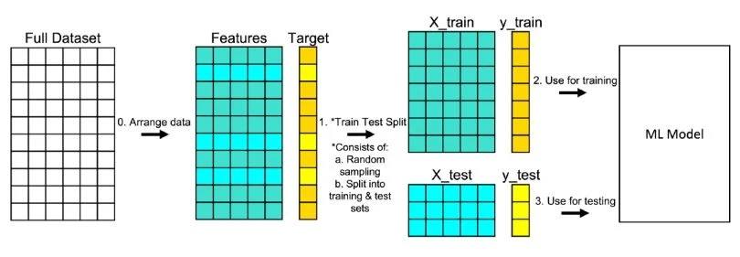

# Ethoscore Methodology


**Source**: [ethoscore.org/methodology](https://ethoscore.org/methodology)

A comprehensive framework for measuring article framing along a calibrated spectrum—**Neutral**, **Loaded**, and **Alarmist**—using transfer learning, ordinal classification, and held-out validation on 125,014 news articles.

---

## I. Conceptual Framework

### Framing Spectrum

Ethoscore measures **framing**—the rhetorical posture and emotional intensity of written content—independent of factual accuracy or political orientation. The system quantifies linguistic urgency, threat language, and dramatic framing.

#### Three Categories

| Category | Description |
|----------|-------------|
| **Neutral** | Measured, sourced, proportionate tone |
| **Loaded** | Emotionally charged, moralizing language |
| **Alarmist** | Imminent threat, catastrophic framing |

### Linguistic Signals

#### Increases Score
- ↑ Doom/threat language intensity
- ↑ High-certainty catastrophe predictions
- ↑ Temporal urgency framing

#### Decreases Score
- ↓ Source attribution and transparency
- ↓ Uncertainty acknowledgment
- ↓ Balanced risk presentation

### Model Outputs

1. **Discrete Classification**: Categorical label with confidence probability
2. **Continuous Scale Score**: Normalized 0–100 intensity metric
3. **Class Probabilities**: Full probability distribution across categories

---

## II. Model Architecture and Training Protocol

### Transfer Learning Architecture

#### 1. Teacher Model Annotation

- **Articles Annotated**: 125,014 articles from NewsAPI.ai Event Registry
- **Teacher Model**: Llama 3.3 (70 billion parameters)
  - Model: `Llama-3.3-70B-Instruct-Turbo`
  - Parameters: ~70B
  - Task: Three-class framing annotation
- **Topic Coverage**: 149 topic categories selected to maximize framing diversity

#### 2. Student Model Training

- **Base Architecture**: `microsoft/deberta-v3-xsmall`
- **Context Window**: 1,500 tokens
- **Training Set**: 121,888 articles
- **Approach**: Knowledge distillation from teacher model
- **Architecture Trade-off**: Embedding breadth traded for network depth, enabling better integration of abstract semantic content

### Dual Model Architecture

#### Ordinal Classification Model

- **Architecture**: Projects article representations onto a one-dimensional latent scale with learned threshold parameters
- **Outputs**: Cumulative probabilities converted to class probabilities and continuous scale scores
- **Performance**:
  - Accuracy: **89.73%**
  - F1 (Macro): **83.12%**

#### Softmax Classification Model

- **Architecture**: Standard three-class classifier with softmax activation
- **Outputs**: Discrete probabilities for each category without ordinal constraint
- **Optimization**: Optimized for categorical accuracy
- **Performance**:
  - Accuracy: **89.51%**
  - F1 (Macro): **81.19%**

### Training Protocol

- **Loss Function**: Standard cross-entropy loss
- **Optimizer**: AdamW
- **Regularization**: Early stopping based on validation set performance (prevents overfitting)
- **Key Finding**: Ordinal model showed slight performance advantages due to the inherent ordinal structure of the framing spectrum

### Training Data Distribution

- **Total Articles**: 125,014
- **Topic Categories**: 149 categories
- **Coverage Areas**: Politics, technology, health, environment, economics, and social issues
- **Purpose**: Represent contemporary news coverage patterns


*Visual distribution chart showing article counts per category across 149 topic areas*

---

## III. Score Normalization System

### Calibrated 0–100 Scale

The ordinal model's latent scale scores (ranging approximately **-15 to +20**) are transformed to a standardized **0–100 normalized scale** via region-based linear interpolation. This normalization preserves ordinal relationships while providing intuitive interpretability.

### Normalization Mapping

| Normalized Range | Category | Raw Score Range |
|------------------|----------|-----------------|
| **0–30** | Neutral | -10.0 to +2.0 |
| **25–65** | Loaded | +1.0 to +6.0 |
| **60–100** | Alarmist | +5.0 to +15.0+ |

### Key Transition Points

- **-0.5**: Neutral ↔ Loaded boundary (~27.5/100)
- **+6.0**: Loaded ↔ Alarmist boundary (~65/100)

### Boundary Smoothing

Scores within **±1.0 unit** of class boundaries receive smoothing to ensure:
- Continuous transitions
- Prevention of artificial cliffs in the normalized scale
- Maintenance of model confidence fidelity

### Methodological Note

Small overlaps between class ranges (e.g., 25–30 appears in both Neutral and Loaded) acknowledge boundary ambiguity inherent in ordinal classification. Articles near boundaries may reasonably belong to adjacent categories depending on context.

---

## IV. Validation and Performance Metrics

### Held-Out Validation Protocol

To ensure generalization, **3,126 articles (2.5%)** were held out as a validation set **never exposed during training**. Models were evaluated on this independent test set to measure real-world performance.

### Ordinal Model Performance

| Metric | Value |
|--------|-------|
| **Overall Accuracy** | 89.73% |
| **F1 Score (Macro)** | 83.12% |
| **F1 Score (Weighted)** | 89.66% |
| **Neutral F1** | 94.01% |
| **Loaded F1** | 81.89% |
| **Alarmist F1** | 73.44% |

### Softmax Model Performance

| Metric | Value |
|--------|-------|
| **Overall Accuracy** | 89.51% |
| **F1 Score (Macro)** | 81.19% |
| **F1 Score (Weighted)** | 89.18% |
| **Neutral F1** | 94.06% |
| **Loaded F1** | 80.93% |
| **Alarmist F1** | 68.59% |

### Performance Analysis

- Both models achieve approximately **90% accuracy** with strong performance on Neutral articles
- Lower F1 scores on Alarmist content reflect the inherent subjectivity and context-dependence of extreme framing detection
- The ordinal model's slight edge suggests that ordinal constraints improve generalization



*Train-test split diagram showing features, target, and ML model pipeline*

---

## V. Probability and Confidence Computation

### Standard Softmax Classification

The model outputs raw logits for each class, which are transformed via the softmax function into a probability distribution summing to 1.0. The highest probability determines the predicted class, and its value represents confidence.

#### Example

```
Input logits: [2.0, 1.0, 0.1]
→ Softmax transformation
Output probabilities: [0.65, 0.24, 0.11]
Prediction: Neutral (65% confidence)
```

### Confidence Interpretation Guidelines

| Confidence Level | Range | Interpretation | Use Case |
|------------------|-------|----------------|----------|
| **High** | ≥80% | Strong model certainty | Suitable for automated classification workflows |
| **Medium** | 50–80% | Moderate certainty | Article may exhibit mixed signals or boundary characteristics |
| **Low** | <50% | High ambiguity | Manual review recommended for critical applications |

---

## VI. Limitations and Transparency

### Inherited Biases

- **Source**: Labels originate from a teacher model (Llama 3.3)
- **Impact**: Any systematic biases in the teacher's classifications are partially inherited by the student models
- **Mitigation**: Teacher model was instructed to focus on framing rather than content
- **Remaining Risk**: Topic-specific annotation patterns may persist

### Context Window Truncation

- **Limit**: Articles truncated to **1,500 tokens** for computational efficiency
- **Impact**: Extended articles may lose nuance from later sections
- **Risk**: Potentially affecting classification accuracy for documents with evolving framing patterns

### Domain-Specific Language Variations

- **Challenge**: Certain topics (e.g., disaster reporting, public health emergencies) naturally employ more urgent language
- **Model Behavior**: Attempts to distinguish between contextually appropriate urgency and exaggerated framing
- **Limitation**: Edge cases require human judgment

### Critical Disclaimer

⚠️ **Ethoscore quantifies framing and rhetorical tone, not factual accuracy or authorial intent.**

- High alarmism scores do **not** imply falsehood
- Low scores do **not** guarantee accuracy
- This system should **complement—not replace**—human editorial judgment in consequential decision-making contexts

---

## Technical Specifications Summary

| Component | Specification |
|-----------|---------------|
| **Total Articles** | 125,014 |
| **Training Set** | 121,888 articles |
| **Validation Set** | 3,126 articles (2.5%) |
| **Topic Categories** | 149 |
| **Teacher Model** | Llama 3.3 (70B parameters) |
| **Student Models** | DeBERTa-v3-xsmall (dual architecture) |
| **Context Window** | 1,500 tokens |
| **Output Scale** | 0–100 (normalized) |
| **Best Accuracy** | 89.73% (Ordinal Model) |
| **Best F1 (Macro)** | 83.12% (Ordinal Model) |

---

## References

- **Methodology Page**: [https://ethoscore.org/methodology](https://ethoscore.org/methodology)
- **Analysis Tool**: [https://ethoscore.org](https://ethoscore.org)
- **Research**: See research section on Ethoscore website

---

*Document compiled from Ethoscore methodology documentation. Last updated: January 2025*

